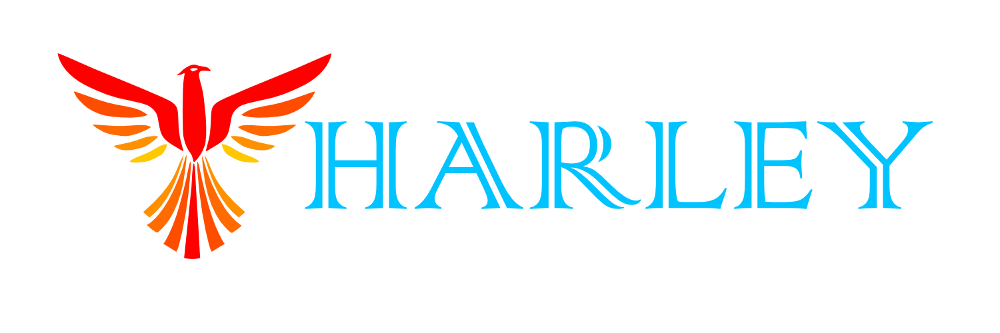

<!-- PROJECT DETAILS -->

	<h1>Open Source Resources</h1>
	
<strong>This project encompasses my open source projects and scripts.</strong>

	

## Table of Contents
<!-- TABLE OF CONTENTS -->

	
Table of Contents

	<ol>
		<li><a href="#about-the-project">About The Project</a></li>
		<li><a href="#requirements">Requirements</a></li>
		<li><a href="#usage">Usage</a></li>
		<li><a href="#gallery">Gallery</a></li>
		<li><a href="#contact">Contact</a></li>
		<li><a href="#acknowledgments">Acknowledgments</a></li>
	</ol>

(<a href="#top">back to top</a>)

<!-- ABOUT THE PROJECT -->
## About The Project
> List the Project Details.

This project is designed to house and document my skills and scripts. This is to better myself, and help the community.

### Referenced Links

No Referenced Links

(<a href="#top">back to top</a>)

<!-- REQUIREMENTS -->
## Requirements
> List the requirements for the project.

- Open Source
- Show Skills
- Help Community

(<a href="#top">back to top</a>)

<!-- USAGE -->
## Usage
> Describe the usage for this project.

(<a href="#top">back to top</a>)

<!-- GALLERY -->
## Gallery
> Insert the the images for this project.

(<a href="#top">back to top</a>)

<!-- CONTACT -->
## Contact
> Contributors to this repo.

- Main Contributor: [Harley Frank](https://github.com/xXsoulshockerXx)

(<a href="#top">back to top</a>)

<!-- ACKNOWLEDGEMENTS -->
## Acknowledgments
> Special people that deserve to be acknowledged.

None to acknowledge at this time.

(<a href="#top">back to top</a>)

